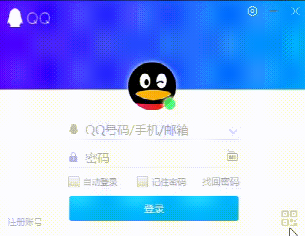

# JavaFX仿QQ登录界面
[toc]
## 1. 项目介绍
### 1.1 项目背景
本项目是一个使用JavaFX仿QQ登录界面的软件，主要是为了学习JavaFX的使用，以及学习一些JavaFX的布局方式。

### 1.2 项目功能

    * 登录界面
    * 注册界面
    * 忘记密码界面
    * 主界面

### 1.3 项目技术

    * JavaFX
    * CSS
    * Java
    * Maven

### 1.4 项目结构

## 项目展示

## ToDoList
- [ ] 代码注释

- [ ] 项目介绍/文档

- [x] 项目截图

- [ ] 项目结构

- [ ] 项目运行

- [ ] 项目打包

- [ ] 项目发布